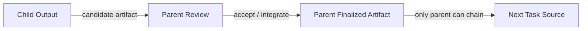

# Kanban Artifact Lifecycle (Canonical)

> 이 문서는 claw-dash Kanban의 **현재 유효한 canonical 규약 문서**입니다.
> `docs/plans/...` 아래의 과거 문서/초안/시행착오 기록과 충돌할 경우, **이 문서가 우선**합니다.

## 1. 목적

이 문서는 Kanban 문서형/구현형 워크플로우에서 아래 4가지를 한 번에 고정하기 위해 존재합니다.

1. **artifact ownership**
2. **parent-only chaining**
3. **lineage / worktree selection**
4. **cleanup guard policy**

지금까지 설계가 흔들린 핵심 원인은, 위 4개가 서로 연결된 하나의 규약인데도 개별 plan 문서와 버그 수정 맥락에 흩어져 있었기 때문입니다.

이 문서의 목표는 다음과 같습니다.

- 현재 유효한 규칙을 한 곳에 모은다
- 구현 중 local assumption으로 설계가 틀어지는 것을 막는다
- 앞으로의 TODO를 같은 기준에서 판단하게 만든다

관련 구현 순서/페이즈 계획은 아래 문서를 따른다.
- `docs/plans/2026-03-16-kanban-artifact-lifecycle-phase-plan.md`

---

## 2. 핵심 모델

### 2.1 Parent / Child 역할

Kanban의 parent / child 관계는 단순히 작업 분할 구조가 아니라, **artifact lifecycle** 상의 역할 분리입니다.

- **child task**: work package 실행 단위
- **parent task**: 최종 통합 / 리뷰 / 확정 단위

비유하면:

- child = 단위 작업 / unit-level 검증
- parent = 통합 작업 / integration-level 검증

### 2.2 Candidate artifact vs Finalized artifact

모든 산출물은 아래 둘 중 하나로 봅니다.

#### Candidate artifact
- child가 만든 부분 산출물
- parent review 이전 상태의 중간 결과물
- downstream chaining의 source-of-truth가 아님

#### Finalized artifact
- parent review를 거쳐 parent가 확정한 최종 결과물
- downstream task를 여는 공식 source-of-truth

핵심 규칙:

> **child output은 candidate artifact이고, parent review 완료 후 parent가 가진 결과물만 finalized artifact다.**

---

## 3. Parent-only chaining 규칙

### 3.1 규칙

새 downstream task를 여는 chaining entry point는 **parent task에만 존재**해야 합니다.

이 규칙은 우연한 UI 제한이 아니라, artifact ownership 규칙의 직접적인 결과입니다.

### 3.2 이유

child 산출물은 아직 아래 위험을 가집니다.

- parent review 전 임시 결과일 수 있음
- 다른 child 산출물과 충돌할 수 있음
- 기능 전체 범위를 대표하지 못할 수 있음
- 후속 태스크의 잘못된 source-of-truth가 될 수 있음

따라서 downstream chain은 다음 전제를 만족해야 합니다.

- source가 parent review를 통과했는가?
- source가 기능 전체의 최종 결과를 대표하는가?
- source owner가 parent인가?

이 전제를 만족하는 entry point는 parent밖에 없습니다.

### 3.3 현재 규칙의 실질적 의미

현재 `Create Intake from Final Proposal` 이 parent 카드/detail에만 붙어 있는 이유는 다음과 같습니다.

- `final-proposal.md`는 parent가 가진 finalized source 문서이기 때문
- child plan/result 문서는 execution record 또는 candidate artifact이기 때문

즉:

> **현재 구현의 parent-only chaining은 맞는 방향이다.**

---

## 4. 문서 경로 / 소유권 규칙

### 4.1 시스템 문서

각 task는 workflow 문서를 가질 수 있습니다.

- `docs/task-<taskId>/plan.md`
- `docs/task-<taskId>/final-proposal.md`

이 문서들은 task 자체의 시스템 문서입니다.

### 4.2 Child candidate output

child는 실행 중 자신의 task-scoped markdown 결과 문서를 만들 수 있습니다.

형태:
- `docs/task-<childTaskId>/<result-name>.md`

해석 기준:
- 이 경로는 **child task execution context의 worktree root 기준 상대 경로**로 본다.
- child 문서 생성에서 project root `docs/` 직접 쓰기나 project root fallback은 허용하지 않는다.
- 이 규칙은 canonical task docs 뿐 아니라, child가 실행 중 만드는 **모든 docs 산출물 전체**에 적용한다.

중요한 점:

- 파일명은 고정하지 않음
- 특정 이름(`development-plan.md`)만 인정하지 않음
- 이 문서들은 **candidate artifact** 로 본다
- 이 경로/파일명 자체가 downstream source-of-truth를 의미하지는 않음

### 4.3 Finalized parent artifact

parent review를 거쳐 downstream source로 쓸 수 있는 문서는 개념적으로 parent 소유여야 합니다.

현재 문서 역할은 아래처럼 분리해서 봅니다.

#### Documentation parent
- 기본 finalized artifact: `docs/task-<parentTaskId>/final-proposal.md`
- 역할: 설계 제안 / 방향성 정리 / 기능 명세 제안
- downstream planning / decomposition의 기본 입력
- child 결과를 parent가 review하며 반영한 뒤, parent `done` 시점에는 **최종 통합본** 역할까지 수행

즉, documentation parent에서는 기본적으로:
- `final-proposal.md` 하나로 충분하며
- 별도의 결과 보고 문서를 추가로 요구하지 않음

참고:
- 사용자가 **명시적으로 spec 수준의 결과물**을 요구하는 예외 시나리오는 향후 별도 페이즈에서 검토할 수 있으나,
- 이번 canonical 규칙의 기본 운영 모델은 `final-proposal.md` 단일 finalized artifact 입니다.

#### Implementation parent
- finalized artifact: `docs/task-<parentTaskId>/final-report.md`
- 역할: 실제 구현 결과 / 검증 / 리스크 / 다음 추천 작업을 담는 최종 결과 보고서

즉, 현재 canonical 해석은 다음과 같습니다.
- `final-proposal.md` = 하려고 했던 것 / 계획된 것
- `final-report.md` = 실제로 해낸 것 / 검증한 것

핵심은 파일명이 아니라 **parent finalization** 입니다.

### 4.4 파일명 규칙

이 시스템은 특정 파일명 하나에 의존하면 안 됩니다.

핵심 규칙은 파일명 자체가 아니라:

1. task-scoped markdown인가
2. artifact lifecycle 안에 있는가
3. parent review로 finalized 되었는가

입니다.

즉, 이름이 `development-plan.md` 가 아니어도 괜찮으며, 특정 파일명 하드코딩을 전제로 설계하지 않습니다.

---

## 5. 리뷰 규칙

### 5.1 Child가 있는 경우

child가 존재하는 경우의 공통 흐름은 다음과 같습니다.

1. child가 candidate artifact를 만든다
2. parent가 child 결과를 전달받는다
3. parent는
   - 자신의 문서
   - child 결과 문서들
   을 취합/검토한다
4. 적합성 검토를 통과하면 parent review가 `done` 으로 간다
5. 그 시점의 parent 결과물이 finalized artifact가 된다

이후 downstream 사용 방식은 task 유형에 따라 달라집니다.

- **documentation parent**: `final-proposal.md` 가 최종 통합본이자 downstream planning 입력 역할까지 수행
- **implementation parent**: `final-report.md` 가 최종 결과/인수 문서 역할을 수행하며, 이번 페이즈에서는 개선안 기반 자동 chaining source로는 사용하지 않음

### 5.2 Child가 없는 경우

parent가 혼자 문서를 작성한 경우에도 동일한 규칙을 적용합니다.

1. parent가 문서를 작성한다
2. parent가 self-review 한다
3. review 통과 후 그 문서는 parent-finalized artifact가 된다

이때도 최종 확정 책임은 parent에 있습니다.

---

## 6. Source-of-truth 규칙

### 6.1 현재 공식 source

현재 구현에서 downstream chaining의 공식 source는 parent의 `final-proposal.md` 입니다.

즉, 현재 제공되는 버튼은:
- `Create Intake from Final Proposal`
- parent done + documentation + final proposal 존재 조건에서만 표시

이는 설계상 의도된 동작입니다.

### 6.2 앞으로의 확장 방향

다음 확장은 아래처럼 정의해야 합니다.

잘못된 표현:
- 아무 child markdown 결과로 chaining
- arbitrary artifact path에서 downstream task open

올바른 표현:
- **parent-finalized general markdown artifact** 로 chaining 확장
- 즉 `final-proposal.md` 외의 finalized parent artifact도 downstream source로 허용

따라서 future feature는 개념적으로:
- `Create Intake from Finalized Artifact`
로 확장될 수 있습니다.

하지만 그 artifact는 여전히:
- parent-owned
- parent-reviewed
- finalized
여야 합니다.

주의:
- 이 확장 방향은 우선 **documentation parent의 parent-finalized markdown artifact 확장**을 우선 대상으로 봅니다.
- 이번 페이즈에서 도입하는 implementation parent의 `final-report.md` 는 **결과 보고/인수 문서**이며,
- 그 안의 개선안은 이번 페이즈에서 자동 chaining source로 사용하지 않습니다.
- 즉, `parent-finalized artifact` 라는 표현이 곧바로 "이번 페이즈에서 모든 finalized artifact가 자동 chaining 가능"을 뜻하지는 않습니다.

### 6.3 이번 페이즈 범위

이번 페이즈에서는 문서형(documentation) parent 전체를 다시 건드리지 않고,
**implementation parent에 `final-report.md` 를 도입하는 것**만 우선 범위로 고정합니다.

즉:
- documentation parent는 현재 기본 규칙(`final-proposal.md` 중심)을 유지
- implementation parent만 결과 보고서 artifact를 새로 도입
- 문서형 spec 흐름(`final-spec.md`)은 이후 별도 페이즈에서 다시 다룸

---

## 7. Lineage / Worktree 규칙

### 7.1 왜 lineage-aware selection이 필요한가

후속 task가 source artifact를 입력으로 삼을 때:

- 그 artifact가 아직 `dev` 에 없고
- 특정 source worktree에만 존재하면
- 단순 `dev` 기준 branch/worktree 준비로는 입력이 보이지 않을 수 있습니다.

그래서 follow-up task는 source artifact lineage를 반영해야 합니다.

### 7.2 현재 승인된 선택 규칙

후속 task의 base selection은 조건부 lineage-aware 방식입니다.

우선순위:
1. source artifact가 실제로 존재하는 source worktree
2. source task의 worktree
3. `dev`

정책:
- source artifact가 아직 root/dev에 없으면 source worktree 기반
- source artifact가 이미 root/dev에 있으면 기존처럼 `dev`
- lookup이 애매해도 source worktree가 살아 있으면 source worktree 우선

### 7.3 metadata 규칙

현재 task metadata에는 lineage-aware base selection을 위해 아래 정보를 저장할 수 있습니다.

- `sourceArtifactPaths[]`
- `sourceWorktreePath`
- `sourceBranch`
- `sourceBaseCommit`
- `worktreeBaseMode`
- `worktreeBaseReason`

이 필드는 explanation / prepare / cleanup guard 모두에 사용됩니다.

---

## 8. Cleanup guard 규칙

### 8.1 목적

source worktree가 downstream lineage에서 참조 중인데도 정리되면, follow-up 입력이 깨질 수 있습니다.

따라서 cleanup은 단순 리소스 정리가 아니라 lineage integrity 문제입니다.

### 8.2 현재 규칙

- downstream lineage가 하나라도 남아 있으면 cleanup defer
- automatic cleanup도 defer
- manual override는 아직 없음
- failed worktree는 policy상 보존 가능

즉, 현재 정책은 **보수적 보존 우선** 입니다.

### 8.3 현재 UI / 상태 노출

현재 task 응답에는 cleanup 관련 상태가 노출됩니다.

- `worktreeCleanupState`
- `worktreeCleanupReason`
- `worktreeCleanupRefCount`

UI에서는:
- detail의 worktree 섹션
- card badge / helper text
- delete 차단 시 action-time feedback
으로 일부 노출됩니다.

---

## 9. 이번 페이즈 설계 결정

### 9.1 Implementation parent `final-report.md`

이번 페이즈에서 새로 도입하는 핵심 finalized artifact는 implementation parent의 `final-report.md` 입니다.

역할:
- 실제 구현 결과를 parent review 관점에서 정리하는 최종 결과/인수 문서
- `final-proposal.md` 가 계획/의도 문서라면, `final-report.md` 는 실제 결과/검증 문서

경로:
- `docs/task-<parentTaskId>/final-report.md`

생성/확정 규칙:
- parent가 `review` 에 진입할 때 1회 자동 초안 생성
- 자동 초안은 아래 1~7 전 섹션의 기본 내용을 가능한 범위에서 모두 채운다
- 이후에는 수동 편집 우선, 자동 overwrite 없음
- 필요 시 추후 별도 편의 기능으로 `refresh draft` 류 기능을 검토할 수 있으나, 이번 페이즈에는 포함하지 않음
- parent가 `done` 으로 확정될 때 최종 확정
- 이번 페이즈에서는 소프트 체크만 적용하고 approve/done을 하드 블로킹하지 않음

문서 구조:
1. 작업 요약
2. 실제 변경 내용
3. child별 작업 요약 / 반영 내용
4. 테스트 / 검증 결과
5. 남은 리스크 / 제약
6. 후속 개선안 / 다음 추천 작업
7. 참조 artifact / 관련 문서

세부 규칙:
- child 섹션은 `무엇을 했는지 / 주요 산출물 / parent 반영 여부` 까지만 요약
- child 상세 실행/검증은 해당 child task detail에서 본다
- 테스트/검증은 parent 관점의 통합 검증만 요약
- 개선안은 이번 페이즈에서 자동 chaining source로 사용하지 않고, 사용자가 읽고 수기로 다음 task를 등록한다

UI 규칙:
- implementation parent detail의 대표 문서 패널은 `final-report.md`
- 기존 `final-proposal.md` 는 보조 문서로 유지
- 즉, implementation parent에서 parent가 먼저 보는 문서는 계획서가 아니라 결과 보고서다

### 9.2 Documentation parent의 현재 규칙 유지

이번 페이즈에서는 documentation parent 전체를 다시 바꾸지 않습니다.

현재 규칙:
- 기본 finalized artifact는 `final-proposal.md`
- child 결과를 반영한 최종 통합본도 기본적으로 `final-proposal.md` 가 맡음
- 사용자가 명시적으로 spec 수준의 결과를 요구한 경우에만 `final-spec.md` 를 별도 검토
- 별도의 `final-report.md` 를 문서형 parent에 기본 도입하지 않음

즉, 이번 페이즈는 implementation parent의 `final-report.md` 도입에만 집중합니다.

---

## 10. 현재 구현 상태

### 10.1 이미 구현된 것

#### A. Final Proposal 기반 chaining
- parent detail의 final proposal에서 새 intake 생성 가능
- task-scoped `.../final-proposal.md` 도 인정하도록 수정됨

#### B. task-scoped markdown artifact 미러링
- child task-scoped markdown 결과물은 **정상 경로에서 worktree 내부에만 유지**한다.
- project root `docs/` 미러링은 child 문서의 기본 모델이 아니다.
- 비정상 target resolution이 발생하면 safety net으로 **warn + worktree path rewrite** 를 허용할 수 있지만, 이는 운영 안전망이지 정상 동작이 아니다.

#### C. lineage-aware worktree base selection
- source artifact 기준으로 `dev` vs source worktree 선택
- 관련 metadata 저장

#### D. cleanup guard
- downstream lineage 참조가 있으면 cleanup/deletion 차단
- 차단 이유/상태/ref count 노출
- delete 차단 시 최신 decorated task 반환

#### E. cleanup UX 1차
- card badge
- helper text
- delete confirm 문구 강화

### 10.2 현재 맞게 유지해야 하는 것

- chaining entry는 parent only
- child output은 candidate artifact
- finalized artifact owner는 parent
- final proposal은 여전히 공식 chaining source의 첫 구현체

### 10.3 Artifact Visibility 기준

- **기본 판정**: filesystem 존재(`os.Stat`) = visible. `artifactExists()`가 이 기준을 담당한다.
- **보조 검증**: finalized intake preflight 시점에 git tracked 여부를 추가 확인한다.
  - git tracked가 아닌 artifact는 follow-up worktree에서 보이지 않을 수 있다.
  - 이 검증은 warning으로만 반환하며, intake 생성을 차단하지 않는다.
- **child docs visibility**: child 문서는 올바른 worktree 내부에 존재해야 하며, `dev/docs`에 잘못 생성되지 않았는지도 함께 본다.
- **문서 root 해석**: parent-owned docs는 document roots(worktree 우선, 필요 시 projectPath fallback)를 사용할 수 있지만, child docs는 worktree roots 기준으로만 읽고 검증한다.
- **변경하지 않는 것**: `artifactExists()` 자체는 filesystem 기반을 유지한다. 다만 child docs의 root 선택은 worktree-only 정책을 따른다.

### 10.4 Child 산출물 Visibility / Handoff 규칙

#### Child docs worktree 경계
- child task-scoped markdown (`docs/task-<childId>/*.md`)은 **worktree 내부 산출물**로 유지한다.
- project root `docs/` fallback이나 root mirroring을 child docs의 정상 경로로 사용하지 않는다.
- 코드 파일(`.go`, `.svelte`, `.ts` 등)은 계속 git merge/commit으로 처리한다.
- 비정상 target resolution이 감지되면 경고 이벤트와 worktree 경로 rewrite를 safety net으로 둘 수 있지만, canonical 정책은 worktree-only write 이다.

#### Parent-only chaining 경계
- `isParentFinalizedArtifactPath()`가 chaining source 자격을 검증:
  - `FinalDocPath` (`final-proposal.md`)
  - `FinalReportPath` (`final-report.md`)
  - `FinalizedArtifacts[]`에 등록된 artifact
- child candidate artifact path는 이 검증을 통과하지 못함
- 따라서 child output에서 직접 downstream intake를 생성할 수 없음

#### Handoff 평가
- child 간 artifact 의존성(`ExpectedArtifacts`)은 `evaluateArtifactHandoffLocked()`가 평가
- expected/actual 불일치 시 `HandoffStatusBlocked` 또는 완료 시점의 `HandoffStatusFailed`로 이어지며 auto review를 통과하지 못함
- 기본 규칙은 exact path + exact state 일치다.
- `docs/*.md` 문서성 markdown handoff만 single changed artifact 기준의 제한적 fallback을 허용한다.
- abstract path(파일 확장자 없음), descriptor path, project-root descriptor 같은 broad handoff는 더 이상 runtime success 근거로 허용하지 않는다.
- code / concrete artifact는 계속 정확한 경로 매칭을 요구한다.

### 10.5 Review Approve Artifact 검증

ReviewApprove(parent → done) 시점에 아래 artifact 존재 여부를 검증한다:

- `FinalDocPath`가 설정되어 있으면 parent document roots 안에서 파일을 찾는다.
- `FinalReportPath`가 설정되어 있으면 parent document roots 안에서 파일을 찾는다.
- `FinalizedArtifacts`의 primary role 항목이 설정되어 있으면 parent document roots 안에서 파일을 찾는다.

여기서 parent document roots는 **worktree path 우선, 필요 시 projectPath fallback** 기준으로 해석한다. child docs는 이 규칙의 대상이 아니며, child 쪽은 worktree-only 정책을 유지한다.

**현재 동작**: split policy
- `FinalDocPath` 누락/미발견은 hard block
- `FinalizedArtifacts`의 primary role 항목 누락/미발견은 hard block
- `FinalReportPath` 누락/미발견은 soft warning — approve는 진행되며 응답에 `warnings` 배열로 반환

추가 보정 규칙:
- implementation parent가 `ReviewApprove()`에 들어올 때 `FinalReportPath`가 비어 있으면, 먼저 `ensureFinalReportDraftLocked()`로 `final-report.md` 초안 생성을 한 번 더 시도한다.
- 그 후에도 `FinalReportPath`가 비어 있으면 `warnings`에 누락 상태를 포함한다.

검증 대상은 `artifactExists()` (filesystem 기반, Phase 1에서 불변성 확인됨)로 확인한다.

### 10.6 Parent Review / Done 자동화 규칙 (Phase 4)

**Auto-Review (기존)**
- 조건: 모든 child가 non-todo, non-in_progress
- 전이: Planning/InProgress → Review
- 부수 효과:
  - documentation parent: `refreshDocumentationParentFinalProposalForReviewLocked()` (`final-proposal.md` 갱신)
  - implementation parent: `ensureFinalReportDraftLocked()` (`final-report.md` 초안 생성)

**Auto-Done (Phase 4 신규)**
- 대상: meeting planning mode parent만
- 조건:
  1. 모든 child가 `StatusDone` + `AutoReviewPassed` + not blocked
  2. parent not blocked, `ManualQueueStatus != "pending"`
  3. `collectReviewApproveArtifactWarningsLocked()` 결과가 비어 있음
- 전이: Review → Done
- 이벤트: `planning_execution_auto_done`
- 비대상: direct planning parent — 수동 `ReviewApprove()` 필요

**Auto-Done Hard Block 정책**

Auto-done이 artifact warning으로 차단될 때의 처리 규칙:

- 차단 조건: `collectReviewApproveArtifactWarningsLocked()` 결과가 비어 있지 않음 (FinalDocPath / FinalReportPath / primary FinalizedArtifact 중 하나라도 부재)
- 결과 상태: parent는 `review` 유지 (`blocked`로 승격하지 않음, 수동 `ReviewApprove()`는 여전히 가능)
- Stuck 필드 설정: `ParentStuckReasonCode = "artifact_warning"`, `ParentStuckHeadline = "자동 완료가 보류되었습니다: finalized artifact 확인 필요"`, `ParentStuckSignals = warning 목록`
- 이벤트: `"planning_execution_auto_done_hold"` (같은 reason code가 연속되면 중복 기록 안 함, stuck 필드는 항상 갱신)
- UI 표시: 기존 "Why this parent is stuck" panel에서 `'artifact_warning'` case로 "Artifact missing" badge 표시
- 해소: artifact가 생성되면 다음 `refreshPlanningExecutionLocked()` 호출에서 auto-done 성공
- 수동 approve: split policy 적용 — finalized source artifact는 hard block, `final-report.md` 계열은 soft warning

### 10.7 Parent Done Commit 정책 (Phase 5)

Parent가 Done으로 전환될 때, `docs/<parentId>/` 하위 미커밋 파일을 감지하여 보고한다.

**원칙**
- 자동 commit/staging 없음 — 순수 감지+보고만 수행
- 워크스페이스 규칙 준수: 커밋 메시지 제안 → 사용자 승인 → 커밋
- child auto-finish와 구분: child는 `attemptAutoFinishLocked()`로 자동 commit, parent는 사용자 판단 영역

**경로별 동작**
- `ReviewApprove()`: API 응답의 `commitCandidates` 필드로 반환
- meeting parent auto-done: `planning_execution_auto_done` 이벤트 메타데이터에 포함
- done parent detail: `GET /api/kanban/tasks/:id/commit-candidates` 로 현재 후보와 기본 commit message 조회
- 사용자 confirm 후 `POST /api/kanban/tasks/:id/commit` 으로 실제 commit 실행

**감지 대상**
- `git status --porcelain -- docs/<parentId>/`
- task-scoped 문서 경로만 감지
- 반환값은 정렬 + 중복 제거된 relative path 목록

**실행 결과 기록**
- 성공: `parent_done_commit_success`
- 실패: `parent_done_commit_failed`
- task schema 확장 없이 event로만 남긴다.

### 10.8 Finalized Artifact Chaining UX (Phase 6)

Finalized artifact는 candidate artifact와 시각적으로 구분되어야 한다.

**Approve 직후 피드백**
- `ReviewApprove()` 응답의 `warnings`, `commitCandidates`는 task detail 범위의 일회성 `approveResult` 상태로 표시한다.
- 표시 시점:
  - approve 시작 전 기존 값 초기화
  - approve 성공 후 현재 task detail에만 표시
  - task detail 전환/닫기 시 초기화
- 색상 의미:
  - warning 피드백: `--accent-orange` 계열
  - commit candidate 피드백: `--accent-blue` 계열

**Finalized artifact 목록 표시**
- finalized artifact는 `length >= 1`이면 항상 표시한다.
- role 기반 스타일:
  - `primary`: 강조 (`--accent-green` 계열)
  - `supplementary`: 보조/완화 (`--text-muted` 계열)
- role badge를 함께 표시해 source 문서 / supporting artifact 차이를 즉시 인지할 수 있어야 한다.

**UI 원칙**
- 백엔드 추가 변경 없이 기존 응답 필드(`warnings`, `commitCandidates`, `finalizedArtifacts[].role`)만 사용한다.
- 색상 하드코딩 금지 — theme token + `color-mix()` 패턴 사용.

### 10.9 Documentation Parent Finalized Markdown Chaining (Phase 7)

문서형(documentation) parent는 `final-proposal.md` 단일 경로에 고정되지 않고, parent-owned / parent-finalized markdown artifact 중 하나를 downstream intake의 primary source로 선택할 수 있다.

**source 후보 규칙**
- 후보는 `finalizedArtifacts[]` 중 `*.md`만 사용한다.
- child 문서는 직접 source 후보가 될 수 없다.
- parent-reviewed / parent-owned artifact만 허용한다.
- 기본 선택은 `role == primary` artifact이며, 없으면 첫 번째 markdown artifact를 사용한다.

**frontend 흐름**
- documentation parent detail에서 `Create Intake from Finalized Artifact` 실행 시 markdown 후보가 2개 이상이면 source selector를 먼저 표시한다.
- 사용자는 한 개를 primary source로 선택할 수 있다.
- primary가 아닌 artifact를 선택하면 경고 문구를 표시한다.
- 후보가 1개 이하면 기존 흐름을 그대로 사용한다.

**backend payload / lineage 규칙**
- intake 생성 payload는 optional `selectedFinalizedSourcePath`를 포함할 수 있다.
- `selectedFinalizedSourcePath`가 비어 있으면 기존 동작과 100% 동일하다.
- 값이 있으면:
  - `SourceFinalDocPath`를 해당 경로로 대체한다.
  - `SourceArtifactPaths`에서 해당 경로를 첫 번째로 재정렬한다.
  - 나머지 finalized markdown은 supplementary context로 남는다.

**검증 원칙**
- intake 생성 전 `finalized-intake-preflight`로 선택된 source path와 artifact set을 검증한다.
- source lineage는 선택 결과를 저장하되, cleanup / ownership 규칙은 기존 parent lineage guard를 유지한다.

---

## 11. 아직 남은 TODO

### TODO 1. Parent 정리/아카이브 자동화 검토

독립적인 explicit cleanup action은 현재 범위에서 폐기합니다.

현재 유지하는 방향:
- cleanup guard / 차단 정책 / 상태 표시는 그대로 유지
- worktree cleanup은 독립 기능으로 노출하지 않음

향후 검토할 방향:
- parent 삭제/정리 시 child 및 worktree 정리를 함께 수행하는 자동화
- merge 이후 더 이상 실행/검토 가치가 없는 parent worktree를 정리하는 아카이브 흐름

즉, cleanup은 별도 수동 액션이 아니라 **parent 정리/아카이브 자동화의 일부**로 다시 설계합니다.

### TODO 2. Invariant tests

아래 규칙은 테스트 이름/행동으로 고정되어야 합니다.

- parent finalized artifact only can open downstream intake
- child candidate artifact must not become chaining source
- lineage reference must defer cleanup
- finalized chaining source owner is parent

문서만으로는 다시 표류할 수 있으므로, 이 규칙들은 테스트 invariant로 승격되어야 합니다.

### TODO 3. 후속 안정화 backlog (2026-03-16)

아래 6개는 현재 artifact lifecycle / chaining / execution 안정화를 위해 별도 설계가 남아 있는 후속 TODO다.

1. **parent review / done 전환 자동화**
   - child 완료 후 parent를 언제 `review` 로 올리고 언제 `done` 으로 닫을지 자동 기준을 정리한다.

2. **parent done 처리 시 commit 정책**
   - `approve` / `done` 과 git commit 관계를 어떻게 둘지 정리한다.

3. **source finalized artifact의 git-visible 기준 정리**
   - 단순 filesystem 존재가 아니라, follow-up worktree base 기준으로 실제로 보장되는 source인지 정의한다.

4. **review / done 하드 블로킹 규칙**
   - source-of-truth 읽기 실패, 산출물 부재, 실행/검증 evidence 부족 시 `review` / `done` 을 막을지 정리한다.

5. **child 산출물 handoff/visibility 후속 정리**
   - child docs의 write/read root는 worktree-only로 확정되었다.
   - 후속 과제는 mirror 여부가 아니라, handoff 평가와 visibility 설명을 다른 artifact 종류까지 얼마나 일관되게 확장할지 정리하는 것이다.

6. **finalized artifact chaining UX 정리**
   - source 문서 / candidate artifact / finalized artifact의 차이를 UI에서 더 명확히 구분한다.

---

## 11. 구현 전 체크리스트

버그 수정/기능 추가 전에 아래 5개를 먼저 확인합니다.

1. 지금 다루는 artifact는 candidate인가 finalized인가?
2. finalized owner는 parent인가?
3. chaining source가 child 쪽으로 새지 않는가?
4. lineage/worktree 선택이 source visibility를 보장하는가?
5. cleanup이 downstream lineage를 깨지 않는가?

이 5개 중 하나라도 흔들리면 local fix로 끝내지 말고 이 문서를 먼저 수정해야 합니다.

---

## 12. INTAKE → DONE 흐름도

### 12.1 개발 태스크 흐름

```mermaid
flowchart TD
    A[INTAKE\n개발 목표 입력\n[현행]] --> B[PLANNING\nparent plan.md 작성\n[현행]]
    B --> C[FINAL PROPOSAL\nparent final-proposal.md 확정\n[현행]]
    C --> D[DECOMPOSITION\nfinal-proposal 기준 child 생성\n[현행]]

    D --> E1[CHILD EXECUTION\n각 child 실행\n[현행]]
    E1 --> E2[CHILD CANDIDATE OUTPUT\nchild 결과물/코드/문서 생성\ncandidate artifact\n[현행]]
    E2 --> E3[CHILD DONE\n단위 작업 완료\nhandoff 상태 기록\n[현행]]

    E3 --> F[PARENT REVIEW\nchild 결과 취합/검토\n통합 검증 관점\n[현행]]
    F --> G[FINAL REPORT DRAFT\nparent final-report.md 초안 자동 생성\n1회 생성, 이후 수동 편집 우선\n[변경]]
    G --> H[REVIEW COMPLETION\napprove 시 done 가능\nfinal-report는 소프트 체크\n[변경]]
    H --> I[DONE\nparent finalized outcome 확정\n[현행+변경]]

    I --> J[대표 결과 문서: final-report.md\nimplementation parent의 최종 결과/인수 문서\n[변경]]
```

핵심:
- `final-proposal.md` = 하려고 했던 것 / 계획된 것
- `final-report.md` = 실제로 해낸 것 / 검증한 것
- child output = candidate artifact
- implementation parent detail에서는 `final-report.md` 를 대표 문서로 본다

### 12.2 문서 태스크 → 개발 태스크 흐름

```mermaid
flowchart TD
    A[INTAKE\n문서/설계 목표 입력\n[현행]] --> B[PLANNING\nparent plan.md 작성\n[현행]]
    B --> C[FINAL PROPOSAL DRAFT\nparent final-proposal.md 작성\n[현행]]
    C --> D[DECOMPOSITION\n필요 시 child 문서 작업 분배\n[현행]]

    D --> E1[CHILD DOCUMENT WORK\n각 child가 설계/조사/부분 문서 작성\n[현행]]
    E1 --> E2[CHILD CANDIDATE DOCS\nchild 문서는 candidate artifact\n[현행]]
    E2 --> E3[CHILD DONE\n단위 문서 작업 완료\n[현행]]

    E3 --> F[PARENT REVIEW\n자신의 문서 + child 문서 취합/검토\n[현행]]
    F --> G[FINAL PROPOSAL FINALIZED\nfinal-proposal.md 자체가 최종 통합본\n[규칙 확정]]
    G --> H[DONE\n문서형 parent 완료\n[현행]]

    H --> I[Create Intake from Final Proposal\nparent 카드에서만 가능\n[현행]]
    I --> J[새 개발 태스크 생성\nsource = parent final-proposal.md\n[현행]]
    J --> K[개발 태스크 흐름으로 진입\nINTAKE -> PLANNING -> ...\n[현행]]
```

핵심:
- documentation parent는 `final-proposal.md` 하나로 충분하다
- child 결과를 반영한 최종 통합본도 `final-proposal.md` 가 맡는다
- child 문서는 직접 chaining source가 아니며, parent finalized proposal만 downstream source다

### 12.3 공통 규칙 요약



공통 규칙:
- child output은 candidate artifact다
- parent review 후 확정된 것만 finalized artifact다
- downstream chaining은 parent-finalized artifact에서만 시작한다

## 13. 요약 규칙

이 문서의 canonical 규칙은 아래 한 문장으로 요약됩니다.

> **기능 수준의 최종 결과물은 parent가 review 후 확정하며, 따라서 downstream chaining은 parent-finalized artifact에서만 시작된다.**

그리고 그 결과로:

- child output은 candidate artifact다
- parent only chaining은 의도된 설계다
- lineage-aware worktree selection은 source visibility를 위한 보조 규칙이다
- cleanup guard는 lineage integrity를 위한 필수 보호 장치다
